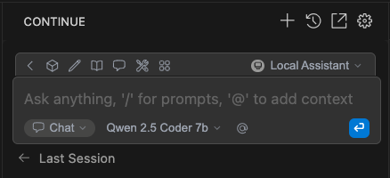

### 1. Install the Continue Extension for VSCode or Cursor.dev

[Visual Studio Code link](https://marketplace.visualstudio.com/items/?itemName=Continue.continue)


### 2. Locate Your .continue Config File
Open the Continue sidebar, click "Add Chat Model", then select "config_file". \
By default, the config file is located at: `~/.continue/config.yaml`


### 3. Start the KAITO Workspace and Enable Port Forwarding
Run the following command to forward traffic to your model:
```
kubectl port-forward svc/workspace-qwen-2-5-coder-7b-instruct 11434:80
```

### 4. Add Your Model to the Continue Config

```
# ~/.continue/config.yaml
name: Local Assistant
version: 1.0.0
schema: v1
models:
  - name: Qwen 2.5 Coder 7b
    provider: vllm
    model: qwen2.5-coder-7b-instruct
    apiBase: http://127.0.0.1:11434/v1
    roles:
      - autocomplete
      - chat
      - edit
      - apply
context:
  - provider: code
  - provider: docs
  - provider: diff
  - provider: terminal
  - provider: problems
  - provider: folder
  - provider: codebase
```

You can now chat with your KAITO model inside VSCode or Cursor.dev!


