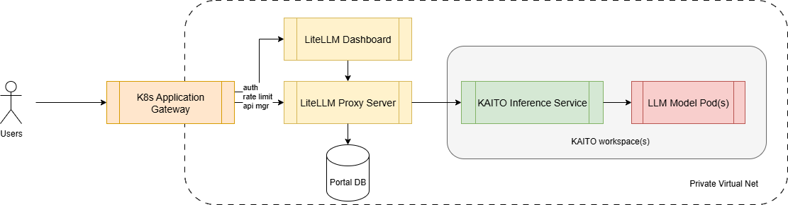

# KAITO + LiteLLM Setup Guide

This guide will help you set up the management gateway using [LiteLLM](https://github.com/BerriAI/litellm).

## Prerequisites
- kubectl and helm installed and configured for your cluster
- A reachable PostgreSQL endpoint.
- An existing Application Gateway (for AGIC) or readiness to provision one

## Component Architecture Diagram



## 1) Create a Kaito workspace and retrieve the Service ClusterIP

Create a KAITO workspace from [examples](https://github.com/kaito-project/kaito/blob/main/examples/inference/).

```bash
# Choose a workspace (namespace)
$ export WORKSPACE_NS=default
$ export WORKSPACE_NAME=workspace-phi-4-mini

$ export WORKSPACE_SVC=$(kubectl get svc -n "$WORKSPACE_NS" "$WORKSPACE_NAME" -o jsonpath="{.spec.clusterIPs[0]}")

# Retrieve model id
$ kubectl run -it --rm --restart=Never curl --image=curlimages/curl -- \
  curl -s http://$WORKSPACE_SVC/v1/models | jq  
 
{
  "object": "list",
  "data": [
    {
      "id": "phi-4-mini-instruct",
      "object": "model",
      "created": 1755498783,
      "owned_by": "vllm",
      "root": "/workspace/vllm/weights",
      "parent": null,
      "max_model_len": 131072,
      "permission": [
        {
          "id": "modelperm-34afa777903e4dcfb65cdbc32e0b50cd",
          "object": "model_permission",
          "created": 1755498783,
          "allow_create_engine": false,
          "allow_sampling": true,
          "allow_logprobs": true,
          "allow_search_indices": false,
          "allow_view": true,
          "allow_fine_tuning": false,
          "organization": "*",
          "group": null,
          "is_blocking": false
        }
      ]
    }
  ]
}

$ export KAITO_MODEL_NAME=phi-4-mini-instruct
```

## 2) Install LiteLLM via Helm (PostgreSQL required)
Provide your PostgreSQL connection info to the chart (./litellm-values.yaml) so LiteLLM can store keys, usage, and logs.

**Provide DB secret**

Update secret in `litellm-db-secret.yaml`.

```yaml
apiVersion: v1
kind: Secret
metadata:
  namespace: litellm
  name: postgres
data:
  # Password for the "postgres" user
  postgres-password: <base64-encoded-password>
  username: <base64-encoded-username>
  password: <base64-encoded-password>
type: Opaque
```

**Provide DB connection endpoint**

Update config in `litellm-values.yaml`.

```yaml
db:
  # Use an existing postgres server/cluster
  useExisting: true

  # How to connect to the existing postgres server/cluster
  endpoint: <your-postgres-endpoint>
  database: litellm
  url: postgresql://$(DATABASE_USERNAME):$(DATABASE_PASSWORD)@$(DATABASE_HOST)/$(DATABASE_NAME)
  secret:
    name: postgres
    usernameKey: username
    passwordKey: password
```

In the model config part, register KAITO model endpoints.

```yaml
proxy_config:
  model_list:
    # At least one model must exist for the proxy to start.
    - model_name: <your-custom-model-name> # used in litellm proxy
      litellm_params:
        model: openai/$KAITO_MODEL_NAME  # openai prefix is required
        api_key: fake-key
        api_base: http://$WORKSPACE_SVC/v1
```

**Install LiteLLM**

```bash
helm install litellm --values ./litellm-values.yaml oci://ghcr.io/berriai/litellm-helm:0.1.742 --namespace litellm --create-namespace
```

For more options, check the [LiteLLM documentation](https://github.com/BerriAI/litellm/blob/main/deploy/charts/litellm-helm/README.md).

## 3) Install Application Gateway Ingress Controller (AGIC) and expose the service
Install AGIC and create an Ingress pointing to the LiteLLM service.

Follow the official guides to install the vendor controllers, then apply the example manifests in `./agc/`:

- Azure (Application Gateway for Containers - Gateway API):
  - Docs: https://learn.microsoft.com/azure/application-gateway/for-containers/
  - Quickstart (AKS add-on): https://learn.microsoft.com/azure/application-gateway/for-containers/quickstart-configure-aks-addon
  - Apply after install: `agc/gateway-azure.yaml` and `agc/httproute.yaml`

- AWS (AWS Load Balancer Controller - ALB Ingress):
  - Docs: https://kubernetes-sigs.github.io/aws-load-balancer-controller/latest/
  - Install: https://kubernetes-sigs.github.io/aws-load-balancer-controller/latest/deploy/installation/
  - After install, create an Ingress annotated for ALB per the docs and point it to the `litellm` service

- GCP (GKE Gateway API or Ingress):
  - GKE Gateway (Gateway API): https://cloud.google.com/kubernetes-engine/docs/how-to/deploying-gateways
  - GKE Ingress: https://cloud.google.com/kubernetes-engine/docs/how-to/load-balance-ingress
  - After install, create a Gateway and HTTPRoute (or an Ingress) targeting the `litellm` service in the `litellm` namespace

## 4) Connect to LiteLLM dashboard

After setting up your ingress controller and routes, you'll need to get the external IP or domain name to access LiteLLM:

```bash
# For Azure Application Gateway, get the gateway address:
export GATEWAY_IP=$(kubectl get gateway llm-gateway -n litellm -o jsonpath='{.status.addresses[0].value}')
echo "LiteLLM is available at: https://$GATEWAY_IP"

# For AWS ALB, get the load balancer address:
export ALB_ADDRESS=$(kubectl get ingress llm-ingress -n litellm -o jsonpath='{.status.loadBalancer.ingress[0].hostname}')
echo "LiteLLM is available at: https://$ALB_ADDRESS"

# For GCP, get the gateway or ingress address:
export GCP_ADDRESS=$(kubectl get gateway llm-gateway -n litellm -o jsonpath='{.status.addresses[0].value}')
# Or for GCP Ingress:
export GCP_ADDRESS=$(kubectl get ingress llm-ingress -n litellm -o jsonpath='{.status.loadBalancer.ingress[0].ip}')
echo "LiteLLM is available at: https://$GCP_ADDRESS"
```

To access the LiteLLM dashboard, you'll need the master key. Retrieve it with:

```bash
kubectl get secret -n litellm litellm-masterkey -o jsonpath='{.data.masterkey}' | base64 -d
```

You can now access the LiteLLM dashboard by navigating to the endpoint URL obtained in the previous step and using this master key to log in.

The dashboard allows you to:
- Create and manage API keys
- Monitor usage statistics
- Configure models and routing
- View request logs
