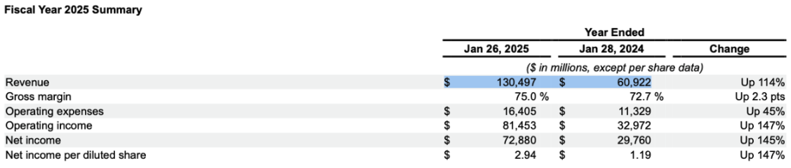
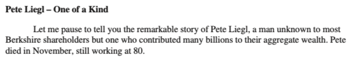

# KAITO RAGEngine backed by llm-d with P/D Disaggregation

This guide comprises the creation of two distinct but related endpoints:
- [Inference Endpoint](#inference-endpoint) - an OpenAI API compatible inference service in Kubernetes created by the llm-d stack
- [RAG Endpoint](#rag-endpoint) - a RAG service provisioned by KAITO with the inference endpoint pointed to 1) for users to efficiently index and query their documents.

## Prerequisites

- An AKS cluster on Kubernetes version 1.31+ with two [Standard_NV36ads_A10_v5](https://learn.microsoft.com/en-us/azure/virtual-machines/sizes/gpu-accelerated/nvadsa10v5-series?tabs=sizebasic) nodes (or equivalent instance types). You can pre-provision the GPU nodes by following [this guide](https://learn.microsoft.com/en-us/azure/aks/use-nvidia-gpu?tabs=add-ubuntu-gpu-node-pool#options-for-using-nvidia-gpus).
- [NVIDIA Device Plugin](https://learn.microsoft.com/en-us/azure/aks/use-nvidia-gpu?tabs=add-ubuntu-gpu-node-pool#nvidia-device-plugin-installation) installed
- [uv](https://docs.astral.sh/uv/) installed
- HuggingFace token with access to [meta-llama/Llama-3.1-8B-Instruct](https://huggingface.co/meta-llama/Llama-3.1-8B-Instruct)
  - Create a HuggingFace account [here](https://huggingface.co/join)
  - Get your token [here](https://huggingface.co/settings/tokens)
> [!IMPORTANT]
> This setup uses [meta-llama/Llama-3.1-8B-Instruct](https://huggingface.co/meta-llama/Llama-3.1-8B-Instruct) on cost-effective, modest hardware for demonstration purposes. Per llm-d guidance, P/D disaggregation shines with larger models (with 70B+ parameters) and long contexts (5k+ input tokens). With smaller models or shorter contexts, performance gains may be minimal compared to aggregation.
> If you have access to higher tier GPUs such as H100s, we recommend using 1 `Standard_ND96isr_H100_v5` nodes with RDMA driver setup via NVIDIA GPU Operator and Network Operator. See [this guide](https://azure.github.io/aks-rdma-infiniband/) for more details.

## Inference Endpoint

1. Clone llm-d repository.

```bash
git clone https://github.com/llm-d-incubation/llm-d-infra
cd llm-d-infra
```

2. Install your local dependencies.

```bash
./quickstart/dependencies/install-deps.sh
```

3. Replace [quickstart/examples/pd-disaggregation/ms-pd/values.yaml](https://github.com/llm-d-incubation/llm-d-infra/blob/main/quickstart/examples/pd-disaggregation/ms-pd/values.yaml) with [the one provided in this folder](./ms-pd-values.yaml). We updated the model, vLLM flags and pod resource requirements for demo purposes.
> [!IMPORTANT]
> If you are using `Standard_ND96isr_H100_v5`, you can skip this step and use the default values.yaml provided by llm-d.

```bash
curl https://raw.githubusercontent.com/kaito-project/kaito-cookbook/refs/heads/master/examples/ragengine-llm-d/ms-pd-values.yaml \
  -o quickstart/examples/pd-disaggregation/ms-pd/values.yaml
```

4. Export your HuggingFace token as an environment variable and create a Kubernetes secret in the namespace `llm-d-pd` (the namespace will be created in the next step).

```bash
export HF_TOKEN=...
export HF_TOKEN_NAME=llm-d-hf-token
export NAMESPACE=llm-d-pd
kubectl create secret generic ${HF_TOKEN_NAME} \
  --from-literal="HF_TOKEN=${HF_TOKEN}" \
  --namespace "${NAMESPACE}" \
  --dry-run=client -o yaml | kubectl apply -f -
```

5. Use `helmfile` to apply the modelservice and GAIE charts on top of it:

```bash
cd quickstart/examples/pd-disaggregation
helmfile apply
```

6. You can follow the llm-d guide to verify the installation before proceeding.

---

## RAG Endpoint

1. 1. Clone kaito-cookbook repository.

```bash
git clone https://github.com/kaito-project/kaito-cookbook.git
cd kaito-cookbook/examples/ragengine-llm-d
```

2. Install and verify RAGEngine controller: following these instructions: https://kaito-project.github.io/kaito/docs/rag.

3. Deploy [`RAGEngine`](./ragengine.yaml) custom resource.
- Replace `<inference-url>` under `.spec.inferenceService.url` field with the ClusterIP of `infra-pd-inference-gateway-istio` service in `llm-d-pd` namespace.
- Replace `.spec.compute.labelSelector.matchLabels` and `.spec.compute.instanceType` with the desired node selector and instance type. In most cases, your cluster should already have sufficient capacity to schedule the RAGService pod. For this example, I want to schedule it on an existing `Standard_DS2_v2` node.
> [!NOTE]
> A GPU node is not required for RAGEngine, as it does not perform model inference. You can use a CPU-only node with sufficient CPU and memory resources for the RAGEngine pod.

```bash
kubectl apply -f ragengine.yaml
```

3. Port-forward the RAGEngine service to access the endpoint locally.

```bash
kubectl port-forward svc/ragengine-llm-d 8000:80
```

4. cURL `/health` to verify the RAG endpoint is working.

```bash
curl localhost:8000/health

{"status":"Healthy","detail":null}
```

---

## Practical Example: Indexing and Querying 10-K Filings

Now, we'll pair together llm-d inference endpoint and KAITO RAGEngine to index the latest SEC 10-K filings of NVIDIA and Berkshire Hathaway stored in the [10-K](10-K) folder, allowing us to ask questions and quickly extract key financial and strategic insights.

Investors, analysts, and researchers would benefit from this approach by bypassing manual document review and accessing accurate, up-to-date information through natural language queries.


1. Clone kaito-cookbook repository:

```bash
git clone https://github.com/kaito-project/kaito-cookbook
cd kaito-cookbook/examples/ragengine-llm-d
```

2. Create a Python virtual environment, install dependencies and index 10-Ks by running the provided script:

```bash
uv venv && source .venv/bin/activate
uv pip install -r requirements.txt
uv run index_10k.py
```

To verify the index, you can list the available index from the `/indexes` endpoint:

```bash
curl http://localhost:8000/indexes

["10-k"]
```

3. With the indexed documents, you can now perform various queries with OpenAI Chat Completion API:

Without `"index_name": "10-k"` field:

```bash
curl -X POST http://localhost:8000/v1/chat/completions \
-H "Content-Type: application/json" \
-d '{
   "model": "meta-llama/Llama-3.1-8B-Instruct",
   "messages": [
     {
       "role": "user",
       "content": "What was the revenue of NVIDIA from 2024 to 2025?"
     }
   ], "max_tokens": 100
  }' | jq -r '.choices[0].message.content'
```

Expected output:

> I do not have access to real-time data or information after my cut-off date of 01 March 2023.

With index `"index_name": "10-k"` field:

```bash
curl -X POST http://localhost:8000/v1/chat/completions \
 -H "Content-Type: application/json" \
 -d '{
    "index_name": "10-k",
    "model": "meta-llama/Llama-3.1-8B-Instruct",
    "messages": [
      {
        "role": "user",
        "content": "What was the revenue of NVIDIA from 2024 to 2025?"
      }
    ], "max_tokens": 100
   }' | jq -r '.choices[0].message.content'
```

Expected output:

> According to the provided documents, NVIDIA's revenue for the years ended January 26, 2025 and January 28, 2024 were:
>- Year Ended January 26, 2025: $130,497 million
>- Year Ended January 28, 2024: $60,922 million

You can verify the output on Page 38 of NVIDIA’s 10-K:



Here is an example of a more complex question you can ask:

Without `"index_name": "10-k"` field:

```bash
curl -X POST http://localhost:8000/v1/chat/completions \
-H "Content-Type: application/json" \
-d '{
   "model": "meta-llama/Llama-3.1-8B-Instruct",
   "messages": [
     {
       "role": "user",
       "content": "Summarize Warren Buffett’s letter in BRK-B’s latest 10-K."
     }
   ], "max_tokens": 200
  }' | jq -r '.choices[0].message.content'
```

Expected output:

> I'm not aware of any information about the latest 10-K filing from Berkshire Hathaway (BRK-B) that includes a letter from Warren Buffett.

With `"index_name": "10-k"` field:

```bash
curl -X POST http://localhost:8000/v1/chat/completions \
 -H "Content-Type: application/json" \
 -d '{
    "index_name": "10-k",
    "model": "meta-llama/Llama-3.1-8B-Instruct",
    "messages": [
      {
        "role": "user",
        "content": "Summarize Warren Buffett’s letter in BRK-B’s latest 10-K."
      }
    ], "max_tokens": 200
   }' | jq -r '.choices[0].message.content'
```

Expected output:

> In his letter, Warren Buffett discusses Berkshire Hathaway's performance and strategy. He notes that the company has made mistakes, but emphasizes the importance of acknowledging and correcting them. Buffett highlights Berkshire's core business, property-casualty insurance, and its unique financial model. He also shares a personal anecdote about Pete Liegl, the founder of Forest River, and explains Berkshire's approach to investing in both controlled businesses and marketable equities.

You can verify the story of Pete Liegl on Page 6 of BRK-B’s 10-K:



---

## Cleanup

```bash
# uninstall KAITO RAGEngine
kubectl delete ragengine ragengine-llm-d
helm uninstall ragengine -n kaito-ragengine

# uninstall llm-d ModelService
cd llm-d-infra/quickstart/dependencies
helmfile destroy
```
